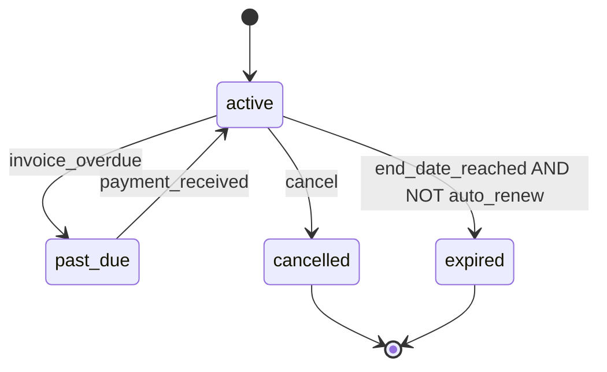
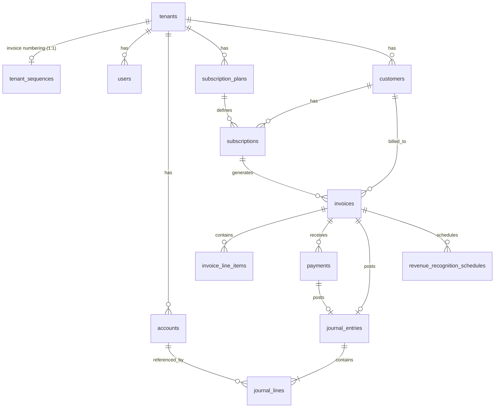

# خطة تنفيذ احترافية — SaaS Subscription Management System

**Stack:** PHP (Laravel) · PostgreSQL · REST API · Senior Backend Level

---

## 1. نظرة عامة على المشروع

### 1.1 الهدف

بناء Backend متعدد المستأجرين (Multi-Tenant) لإدارة:

- Tenants + Admins
- Plans / Customers / Subscriptions
- Invoicing + Payments
- **Double-Entry Bookkeeping** مع **Deferred Revenue** و **Revenue Recognition**
- Financial Reports (Income Statement + Balance Sheet)

### 1.2 قرارات معمارية رئيسية (Senior Decisions)

| القرار | الاختيار المقترح | التبرير |
|--------|------------------|---------|
| Multi-Tenancy | **Shared DB + `tenant_id` + PostgreSQL RLS** | عزل على مستوى DB |
| DB Roles | **`migrate_user` (owner) + `app_user` (non-owner)** | Owner يتجاوز RLS — التطبيق **يجب** أن يتصل بـ `app_user` |
| Connection safety | **`DB::transaction` + `SET LOCAL` لكل request/job** | منع تسرب tenant context عبر connection pool |
| Isolation level | **`READ COMMITTED` + `SELECT FOR UPDATE`** | حماية concurrent payments/billing |
| Framework | **Laravel 11** | Eloquent, Queues, Sanctum, Testing |
| Auth | **Sanctum API tokens** | Stateless REST |
| Accounting | **Domain Layer + DB constraints إلزامية** | توازن القيود على مستوى DB وليس app فقط |
| Revenue basis | **Accrual** | Recognition مستقل عن الدفع |
| Jobs | **Fan-out: job منفصل لكل tenant** | فشل tenant واحد لا يوقف الباقي |
| Timezone storage | **`DATE` = tenant-local calendar dates؛ `timestamptz` = UTC** | قرار واحد — لا "أو" |
| Error format | **Structured envelope موحّد** | `{ success, data \| error }` — ليس RFC 7807 في MVP |
| Reports (MVP) | **SUM on journal_lines + indexes** | Materialized balances = post-MVP |
| Idempotency | **Server keys (Jobs) + Client keys (Payments)** | نوعان مختلفان |
| Plan change mid-cycle | **Out of MVP scope** | موثّق صراحة في §4.4 و §20 |

### 1.3 مبدأ محاسبي حاكم (Accrual Policy)

> **Recognition تعتمد فقط على مرور الزمن (period elapsed)، ولا علاقة لها بحالة الدفع.**
> فاتورة غير مدفوعة لشهر منتهٍ تُعترف بإيرادها بالكامل، ويبقى `Accounts Receivable > 0`.
>
> **Payment** و **Recognition** مساران مستقلان:
> - Payment: `Cash ↔ Accounts Receivable` (تحصيل)
> - Recognition: `Deferred Revenue ↔ Subscription Revenue` (استحقاق)

---

## 2. هيكل المشروع (Clean Architecture + DDD-lite)

```
app/
├── Domain/
│   ├── Tenancy/
│   ├── Billing/
│   ├── Subscription/
│   ├── Accounting/          ← القلب
│   └── Reporting/
├── Application/
│   ├── Actions/
│   ├── DTOs/
│   └── Services/
├── Infrastructure/
│   ├── Persistence/
│   ├── Postgres/            ← RLS + TenantSession + DB roles
│   └── Jobs/
├── Http/
│   ├── Controllers/
│   ├── Requests/
│   ├── Resources/
│   └── Middleware/
└── Support/
    ├── TenantContext.php
    └── Money.php
```

**مبدأ Senior:** Controllers thin. كل قيد محاسبي عبر `PostJournalEntryAction`. التصحيح عبر `ReverseJournalEntryAction` فقط — **لا** تعديل قيد posted.

---

## 3. Multi-Tenancy — التصميم الكامل

### 3.1 PostgreSQL RLS + DB Roles (إلزامي — بدون هذا RLS = وهم)

**المشكلة:** Table owner في PostgreSQL **يتجاوز RLS** حتى مع `FORCE`. لو Laravel يتصل بنفس role الذي أنشأ الجداول، RLS **لا يعمل بصمت**.

**الحل — roleان منفصلان:**

```sql
-- Migration 000: roles (تُنفَّذ بـ superuser/migrate_user)
CREATE ROLE migrate_user LOGIN PASSWORD '...';   -- migrations + schema DDL فقط
CREATE ROLE app_user LOGIN PASSWORD '...';       -- runtime التطبيق

-- بعد إنشاء كل جدول (migrate_user):
ALTER TABLE customers OWNER TO migrate_user;
GRANT SELECT, INSERT, UPDATE, DELETE ON ALL TABLES IN SCHEMA public TO app_user;
GRANT USAGE, SELECT ON ALL SEQUENCES IN SCHEMA public TO app_user;
-- app_user: NO BYPASSRLS, NOT owner, NOT superuser
```

**`.env` runtime:**

```env
DB_USERNAME=app_user          # Laravel app + queue workers
DB_MIGRATE_USERNAME=migrate_user  # php artisan migrate فقط
```

**RLS policy + fail-closed helper:**

```sql
CREATE OR REPLACE FUNCTION app_current_tenant_id()
RETURNS uuid AS $$
BEGIN
  IF current_setting('app.current_tenant', true) IS NULL
     OR current_setting('app.current_tenant', true) = '' THEN
    RAISE EXCEPTION 'tenant context not set';
  END IF;
  RETURN current_setting('app.current_tenant', true)::uuid;
END;
$$ LANGUAGE plpgsql STABLE;

ALTER TABLE customers ENABLE ROW LEVEL SECURITY;
ALTER TABLE customers FORCE ROW LEVEL SECURITY;

CREATE POLICY tenant_isolation ON customers
  USING (tenant_id = app_current_tenant_id());
```

**RLS يُفعَّل في نفس migration الذي ينشئ الجدول** — ليس migration منفصلة لاحقاً (انظر §11).

### 3.2 Connection Pooling + SET LOCAL — قواعد صارمة

| القاعدة | التفصيل |
|---------|---------|
| كل HTTP request | `TenantContext::runAs()` → `DB::transaction()` → `SET LOCAL` → business logic → commit |
| كل Queue job (tenant-scoped) | نفس النمط — **transaction جديدة** في بداية كل iteration |
| Persistent connections | **`DB::disconnect()` بعد كل tenant job** أو `config: database.persistent = false` في production |
| PgBouncer | **Transaction pooling mode** فقط — `SET LOCAL` يعمل؛ Session mode يتطلب `SET` per connection (تجنبه) |
| Eloquent Global Scope + RLS | **مصدر واحد:** `TenantContext::id()` — لكن RLS هو خط الدفense النهائي؛ Scope لا يغني عن transaction+SET LOCAL |
| ممنوع | Query tenant-scoped **خارج** `DB::transaction` + `SET LOCAL` |

**TenantSession (Infrastructure):**

```php
TenantContext::runAs(string $tenantId, callable $callback): mixed
{
    return DB::transaction(function () use ($tenantId, $callback) {
        DB::statement("SET LOCAL app.current_tenant = ?", [$tenantId]);
        return $callback();
    });
    // SET LOCAL يُلغى تلقائياً عند COMMIT/ROLLBACK — لا تسرب للـ connection التالي
}
```

**Test إلزامي:** Integration test يتصل بـ `app_user` (ليس owner) ويثبت RLS يعمل — test محلي بـ superuser **يكذب**.

### 3.3 جداول Tenancy

```text
tenants
  id (uuid PK)
  name, slug (unique), status (active/suspended)
  settings (jsonb) — timezone (IANA), currency, fiscal_year_start
  created_at

users
  id, tenant_id (FK), email, password_hash
  role (admin|user), is_active
  UNIQUE(tenant_id, email)

tenant_signup_events (audit)
```

### 3.4 Sign-up Flow

```
POST /api/v1/auth/register-tenant
Body: { company_name, admin_name, email, password, timezone? }
```

**RegisterTenantAction — transaction boundary (حرج):**

> **tenant + admin user + COA seed = transaction واحدة.** أي exception → rollback كامل — لا orphan tenant بدون user أو COA.

```
RegisterTenantAction::execute():

  DB::transaction(function () {

    // 1. Create tenant (جدول tenants بدون RLS tenant-scoped — global registry)
    $tenant = Tenant::create([...]);

    // 2. ضبط context داخل نفس الـ transaction — قبل أي insert tenant-scoped
    DB::statement("SET LOCAL app.current_tenant = ?", [$tenant->id]);

    // 3. Create admin user (tenant-scoped — RLS active)
    $user = User::create([tenant_id => $tenant->id, role => admin, ...]);

    // 4. Seed COA (tenant-scoped — RLS active)
    SeedDefaultChartOfAccountsAction::execute($tenant);

    // 5. Audit log
    AuditLog::create([...]);

    return [$tenant, $user];
  });

  // بعد COMMIT ناجح فقط:
  IssueJwtToken($tenant, $user);
```

**ملاحظات:**

| نقطة | التفصيل |
|------|---------|
| لا `runAs` منفصل | `SET LOCAL` داخل **نفس** transaction الـ registration |
| فشل COA seed | rollback يحذف tenant + user تلقائياً |
| JWT | يُصدر **بعد** commit — خارج transaction |
| Test | `RegisterTenantRollbackTest` — force COA failure → assert 0 tenants/users |

**جدول `tenants`:** لا يخضع لـ RLS tenant isolation (registry عام). باقي الجداول tenant-scoped.

### 3.5 Security Layers

| Layer | Mechanism |
|-------|-----------|
| DB | RLS FORCE + `app_user` non-owner + fail-closed function |
| App | Global Scope ← `TenantContext::id()` |
| API | Middleware + scoped Route Binding → **404** |
| Tests | RLS tests with **`app_user` connection** |

### 3.6 TenantScope + Route Model Binding

```php
Route::bind('invoice', fn ($id) =>
    Invoice::where('tenant_id', TenantContext::id())->findOrFail($id)
);
```

- Policies = **roles only** (admin vs user) — ليس tenant ownership
- Cross-tenant ID → **404** على كل resources

### 3.7 Jobs — Fan-out (لا loop تسلسلي في job واحد)

```
RunBillingOrchestratorJob (scheduler — خفيف):
  tenants = Tenant.active.pluck('id')
  FOR each tenant_id:
    RunBillingForTenantJob::dispatch(tenant_id)->onQueue('billing')

RunBillingForTenantJob(tenant_id):
  TRY:
    TenantContext::runAs(tenant_id, fn () => RunBillingCycleAction::execute())
  CATCH Exception $e:
    Log + report to failed_jobs (tenant_id in payload)
    // لا يوقف tenants أخرى — كل tenant job مستقل
  FINALLY:
    DB::disconnect()   // منع تسرب connection state
```

**Retry policy:** `RunBillingForTenantJob`: 3 tries, exponential backoff. Dead-letter queue للـ tenants الفاشلة المتكررة.

**Recognition:** نفس النمط — `RunRecognitionForTenantJob` per tenant.

---

## 4. Domain Model

### 4.1 Subscription Plans

```text
subscription_plans
  id, tenant_id, name, description
  price_cents (bigint), currency, billing_interval (monthly|yearly)
  status (active|inactive)
  UNIQUE(tenant_id, name)
```

**Plans API — CRUD كامل:**

| Method | Endpoint | Action |
|--------|----------|--------|
| GET | `/api/v1/plans` | List (filter: status) |
| POST | `/api/v1/plans` | Create |
| GET | `/api/v1/plans/{id}` | Show |
| PUT/PATCH | `/api/v1/plans/{id}` | Update |
| DELETE | `/api/v1/plans/{id}` | Soft delete → `DeactivatePlanAction` |

**DeactivatePlanAction / DELETE (مع lock — يمنع TOCTOU):**

```
DB::transaction:
  SELECT * FROM subscription_plans WHERE id = ? FOR SHARE

  IF EXISTS subscriptions WHERE plan_id = ? AND status IN (active, past_due):
    REJECT 422 "Plan has active subscriptions"
  ELSE:
    SET status = inactive   // soft delete — لا hard delete في MVP
```

> **MVP statuses only:** لا `trialing` في هذا الفحص — انظر §4.3.

`FOR SHARE` يمنع إنشاء subscription جديدة على نفس plan concurrently أثناء deactivation check.

> **ملاحظة CRUD:** `DELETE` = soft deactivate (status=inactive). لا hard delete — يحافظ على سجل الاشتراكات التاريخية.

### 4.2 Customers

```text
customers
  id, tenant_id, name, email, status (active|inactive), billing_address (jsonb)
  deleted_at (nullable)   ← soft delete
```

**Customers API — CRUD كامل:**

| Method | Endpoint | Action |
|--------|----------|--------|
| GET | `/api/v1/customers` | List |
| POST | `/api/v1/customers` | Create |
| GET | `/api/v1/customers/{id}` | Show |
| PUT/PATCH | `/api/v1/customers/{id}` | Update |
| DELETE | `/api/v1/customers/{id}` | Soft delete → `DeleteCustomerAction` |

**DeleteCustomerAction:**

```
DB::transaction:
  SELECT * FROM customers WHERE id = ? FOR UPDATE

  IF EXISTS subscriptions WHERE customer_id = ? AND status IN (active, past_due):
    REJECT 422 "Customer has active subscriptions"
  IF EXISTS invoices WHERE customer_id = ? AND status IN (open, partially_paid):
    REJECT 422 "Customer has open invoices"
  ELSE:
    SET deleted_at = now(), status = inactive
```

> **ملاحظة CRUD:** `DELETE` = soft delete (`deleted_at`). Global scope يستبعد `deleted_at IS NOT NULL`.

### 4.3 Subscriptions

```text
subscriptions
  id, tenant_id, customer_id, plan_id
  status (active|cancelled|expired|past_due)   ← MVP فقط — انظر §4.5
  start_date, end_date, auto_renew
  current_period_start, current_period_end   ← DATE tenant-local
  cancelled_at, cancel_at_period_end, next_billing_at
```

**MVP statuses:** `active`, `past_due`, `cancelled`, `expired` — **لا `trialing` في MVP** (Post-MVP bonus: trial period endpoint).

**State Machine (MVP):**



**Subscriptions API — CRUD + Cancel:**

| Method | Endpoint | Action |
|--------|----------|--------|
| GET | `/api/v1/subscriptions` | List (filter: status, customer_id) |
| POST | `/api/v1/subscriptions` | Create |
| GET | `/api/v1/subscriptions/{id}` | Show |
| PUT/PATCH | `/api/v1/subscriptions/{id}` | Update (end_date, auto_renew فقط — لا plan change) |
| POST | `/api/v1/subscriptions/{id}/cancel` | Cancel → `CancelSubscriptionAction` |

**Create Subscription:** validate plan active; set periods via `TenantTimezoneService`; **لا** فاتورة تلقائية.

**CancelSubscriptionAction:**

```
POST /api/v1/subscriptions/{id}/cancel
Body: { cancel_at_period_end: boolean (default true) }

IF subscription.status NOT IN (active, past_due):
  REJECT 422

IF cancel_at_period_end = true (default — SaaS standard):
  SET cancel_at_period_end = true, cancelled_at = now()
  // يبقى active حتى current_period_end — Billing Job لا يجدد بعدها

IF cancel_at_period_end = false (immediate):
  SET status = cancelled, cancelled_at = now(), auto_renew = false
  // لا فوترة future — الفواتير المفتوحة تبقى قابلة للتحصيل
```

**Test:** `CancelSubscriptionAtPeriodEndTest`, `CancelSubscriptionImmediateTest`

### 4.4 Plan Change Mid-Cycle — Out of MVP Scope

**غير مدعوم في MVP.** لا upgrade/downgrade/proration mid-cycle.

| السينario | السلوك في MVP |
|----------|---------------|
| تغيير plan | **غير متاح** — API يرجع 501 أو لا endpoint |
| البديل للديمو | Cancel subscription + create new subscription |

**Post-MVP (bonus):** proration, credit notes, schedule adjustment, **trialing** status. موثّق في README تحت "Future improvements".

### 4.5 Past Due — متى وكيف؟

**المشكلة:** من يحوّل `active` → `past_due`؟

**الحل — `MarkPastDueSubscriptionsAction` (Job يومي):**

```
tenant.settings.grace_period_days = 7   (default, configurable per tenant)

FOR each subscription WHERE status = active:
  IF EXISTS invoice WHERE subscription_id = sub.id
     AND status IN (open, partially_paid)
     AND due_at + grace_period_days < now():
    SET subscription.status = past_due

FOR each subscription WHERE status = past_due:
  IF all open invoices paid OR void:
    SET subscription.status = active
```

| الحدث | السلوك |
|-------|--------|
| Billing job ينشئ invoice | `due_at` = issued_at + 30 days (default) |
| بعد `due_at + 7 days` بدون دفع كامل | subscription → `past_due` |
| Payment يغطي `amount_due` | subscription → `active` (§6.2) |

**Scheduler:** `MarkPastDueOrchestratorJob` daily → fan-out per tenant (نفس نمط §3.7).

**Test:** `MarkPastDueAfterGracePeriodTest`, `PastDueRevertsOnFullPaymentTest`

---

## 5. Billing & Invoicing

### 5.1 Invoices

```text
invoices
  id, tenant_id, subscription_id, customer_id
  invoice_number, status (draft|open|paid|partially_paid|void)
  subtotal_cents, tax_cents, total_cents
  amount_paid_cents, amount_due_cents
  period_start, period_end     ← DATE (tenant-local calendar)
  issued_at, due_at            ← timestamptz (UTC)
  billing_idempotency_key      ← UNIQUE per tenant
  journal_entry_id
```

### 5.1.1 Invoice Numbering — `tenant_sequences`

```text
tenant_sequences
  tenant_id (PK, FK)
  invoice_next_number bigint DEFAULT 1
```

**AllocateInvoiceNumberAction** (داخل CreateInvoiceAction transaction):

```
DB::transaction:
  SELECT invoice_next_number FROM tenant_sequences
    WHERE tenant_id = ? FOR UPDATE

  number = row.invoice_next_number
  UPDATE tenant_sequences SET invoice_next_number = number + 1

  RETURN formatted: "INV-{YYYY}-{number padded 5}"   // e.g. INV-2025-00042
```

- يُنشأ row في `tenant_sequences` عند RegisterTenant (ضمن نفس transaction §3.4)
- `SELECT FOR UPDATE` يمنع duplicate numbers تحت concurrency
- **Test:** `ConcurrentInvoiceNumberingTest`

### 5.2 Billing Job — RunBillingCycleAction

```
FOR each subscription WHERE status=active AND next_billing_at <= now(tenant_tz):

  DB::transaction (isolation: READ COMMITTED):

    SELECT * FROM subscriptions WHERE id = ? FOR UPDATE

    billing_idempotency_key = "{subscription_id}:{period_start}:{period_end}"

    IF invoice exists with key → SKIP (idempotent), COMMIT

    CreateInvoiceAction
    PostInvoiceJournalEntryAction
    CreateRecognitionSchedulesAction

    // next_billing_at يتقدّم ONLY بعد نجاح الخطوات أعلاه:
    UPDATE subscription SET next_billing_at = ..., current_period = ...

  COMMIT

  ON UniqueConstraintViolation(billing_idempotency_key):
    ROLLBACK → SKIP (already billed)

  ON any other Exception:
    ROLLBACK → next_billing_at NOT advanced → log + re-raise
    // Test: BillingFailureDoesNotAdvancePeriodTest
```

**قاعدة حاسمة:** `next_billing_at` **لا يتقدّم** إلا بعد commit ناجح لـ invoice + journal + schedules. أي فشل آخر = rollback كامل + الفترة تُعاد محاولتها في run تالي.

### 5.3 Invoice Journal ($100)

```
DR  Accounts Receivable     100
CR  Deferred Revenue        100
```

### 5.4 Recognition Schedules (Monthly vs Yearly)

**Monthly:** 1 invoice → 1 schedule (full amount).

**Yearly $1200:** 1 invoice → **12 schedules** × $100. Recognition Job شهرياً يستهلك schedule واحد.

---

## 6. Payments

### 6.1 Schema

```text
payments
  id, tenant_id, invoice_id, customer_id
  amount_cents, payment_method, status, paid_at
  client_idempotency_key   ← REQUIRED, UNIQUE per tenant
  journal_entry_id
```

### 6.2 Idempotency vs Overpayment — مساران مختلفان

| الحماية | الآلية | يمنع |
|---------|--------|------|
| **Idempotency** | `client_idempotency_key` UNIQUE | Retry نفس الطلب (double-click) |
| **Overpayment** | `SELECT FOR UPDATE` على invoice + `amount <= amount_due` | طلبان مختلفان يدفعان أكثر من المستحق |

**RecordPaymentAction:**

```
DB::transaction (READ COMMITTED):

  1. IF payment exists with client_idempotency_key → return existing (200)

  2. SELECT * FROM invoices WHERE id = ? FOR UPDATE   ← row lock على invoice

  3. IF invoice.status IN (paid, void) → REJECT 422
  4. IF amount_cents <= 0 → REJECT 422
  5. IF amount_cents > invoice.amount_due_cents → REJECT 422 "Overpayment"
     // overpayment protection — مستقل عن idempotency

  6. PostJournalEntry: DR Cash / CR AR
  7. UPDATE invoice.amount_paid_cents, amount_due_cents, status
  8. IF subscription past_due AND fully paid → active

COMMIT
```

**Test إلزامي:** `ConcurrentPartialPaymentTest` — دفعتان متزامنتان لا تتجاوزان `total_cents`.

**Recognition:** لا تقرأ `amount_paid_cents` — مسار مستقل (Accrual).

---

## 7. Accounting Engine

### 7.1 Chart of Accounts

```
1000 Cash (asset)
1100 Accounts Receivable (asset)
2100 Deferred Revenue (liability)
3000 Retained Earnings (equity)
4000 Subscription Revenue (revenue)
```

### 7.2 Journal Tables + DB Constraints (إلزامية — ليست optional)

```sql
CREATE TABLE journal_lines (
  id uuid PRIMARY KEY,
  journal_entry_id uuid NOT NULL REFERENCES journal_entries(id),
  account_id uuid NOT NULL,
  debit_cents bigint NOT NULL DEFAULT 0 CHECK (debit_cents >= 0),
  credit_cents bigint NOT NULL DEFAULT 0 CHECK (credit_cents >= 0),
  description text,
  CONSTRAINT jl_one_side_nonzero CHECK (
    (debit_cents > 0 AND credit_cents = 0) OR
    (credit_cents > 0 AND debit_cents = 0)
  )
);

-- Trigger: entry must balance
CREATE OR REPLACE FUNCTION assert_journal_entry_balanced()
RETURNS TRIGGER AS $$
DECLARE total_dr bigint; total_cr bigint;
BEGIN
  SELECT COALESCE(SUM(debit_cents),0), COALESCE(SUM(credit_cents),0)
  INTO total_dr, total_cr FROM journal_lines WHERE journal_entry_id = NEW.journal_entry_id;
  IF total_dr != total_cr THEN
    RAISE EXCEPTION 'journal entry % unbalanced: dr=% cr=%', NEW.journal_entry_id, total_dr, total_cr;
  END IF;
  RETURN NEW;
END;
$$ LANGUAGE plpgsql;

CREATE CONSTRAINT TRIGGER journal_entry_balance_check
  AFTER INSERT OR UPDATE ON journal_lines
  DEFERRABLE INITIALLY DEFERRED
  FOR EACH ROW EXECUTE FUNCTION assert_journal_entry_balanced();
```

**DEFERRABLE:** يسمح بإدراج lines متعددة في transaction واحدة قبل الـ commit check.

```text
journal_entries
  status (posted|reversed)   ← reversed = تم عكسه بقيد جديد، الأصلي immutable
  reverses_entry_id (nullable) ← FK للقيد الأصلي
```

### 7.3 PostJournalEntryAction + ReverseJournalEntryAction

**Post (single gateway):**

```php
execute(JournalEntryDraft $draft): JournalEntry
{
    assert($draft->isBalanced());  // app-level pre-check
    return DB::transaction(fn () => insert entry + lines);
    // DB trigger = final guarantee
}
```

**Reverse (corrections — never edit posted entry):**

```php
ReverseJournalEntryAction::execute(JournalEntry $original): JournalEntry
{
    assert($original->status === 'posted');
    // Create NEW entry with swapped DR/CR lines
    // Mark original.status = 'reversed', link reverses_entry_id
    // NEVER UPDATE journal_lines of original
}
```

**MVP balance strategy (قرار نهائي):**

- **MVP:** `AccountBalanceQuery` = `SUM(journal_lines)` grouped by account — **O(n) per report**
- **Indexes كافية للـ MVP:** `(tenant_id, account_id)`, `(tenant_id, entry_date)` on journal_entries/lines join path
- **Post-MVP:** materialized `account_balances` table updated in same transaction as posting

### 7.4 Revenue Recognition — Accrual + Batch Boundaries

```
RecognizeSubscriptionRevenueAction (per tenant, via fan-out job):

FOR each schedule WHERE status=pending AND period_end <= run_date:

  // كل schedule = transaction منفصلة (safe partial failure + idempotent retry)
  DB::transaction:
    SELECT * FROM revenue_recognition_schedules WHERE id = ? FOR UPDATE

    IF status != pending → SKIP

    recognition_idempotency_key = "{schedule.id}:{period_end}"

    PostJournalEntry: DR Deferred / CR Revenue
    UPDATE schedule SET status=recognized, journal_entry_id=...

  ON UniqueConstraintViolation → SKIP (already recognized)

  ON Exception → log schedule_id, continue next schedule (don't abort entire tenant)
```

**Partial failure:** Job crash بعد schedule 5/12 → re-run يكمل 6–12 فقط (schedules 1–5 already recognized).

**Idempotency:** UNIQUE on `(tenant_id, recognition_idempotency_key)` in journal_entries.

### 7.5 Accounting Invariants (Tests)

1. debits = credits (app + DB trigger)
2. Invoice → AR/Deferred
3. Payment → Cash/AR
4. Recognition → Deferred/Revenue (independent of payment)
5. Balance sheet equation
6. Idempotent job re-run
7. Unpaid recognition scenario
8. Yearly 12 schedules
9. Concurrent partial payments ≤ amount_due
10. Billing failure → next_billing_at unchanged
11. Reverse entry creates new journal — original immutable

---

## 8. Financial Reports APIs

### 8.1 Timezone — قرار تخزين نهائي (لا "أو")

| نوع الحقل | التخزين | الاستخدام |
|-----------|---------|-----------|
| `period_start`, `period_end`, `start_date` | **`DATE`** — tenant-local calendar date | Billing periods, schedules |
| `issued_at`, `paid_at`, `posted_at`, `next_billing_at` | **`timestamptz` UTC** | Timestamps |
| Report `from`/`to`/`as_of` params | **Tenant-local dates** | `TenantTimezoneService` يحوّل boundaries |

**Rule:** Period boundary = `[period_start, period_end]` inclusive as calendar dates in tenant timezone. لا UTC conversion على DATE fields.

### 8.2 Income Statement

```
GET /api/v1/reports/income-statement?from=2025-01-01&to=2025-06-30
```

`net_income_cents = SUM(credits - debits) on account 4000 WHERE entry_date IN range`

### 8.3 Balance Sheet + Equity

**المطلوب في المهمة (إلزامي في response):** Cash, Accounts Receivable, Deferred Revenue.

**إضافي (للتوازن المحاسبي):** `equity` / Retained Earnings — optional field في JSON.

```json
{
  "as_of": "2025-06-30",
  "assets": {
    "cash_cents": 10000,
    "accounts_receivable_cents": 5000,
    "total_assets_cents": 15000
  },
  "liabilities": {
    "deferred_revenue_cents": 3000,
    "total_liabilities_cents": 3000
  },
  "equity": {
    "retained_earnings_cents": 12000,
    "total_equity_cents": 12000
  },
  "balanced": true
}
```

**Formulas:**

```
cash_cents              = balance(1000, as_of)
accounts_receivable     = balance(1100, as_of)
deferred_revenue        = balance(2100, as_of)   // liability: credits - debits

// Retained Earnings في MVP (بدون expense accounts):
// = إجمالي Subscription Revenue المعترف بها حتى as_of — ليس "رصيد حساب 3000" منفصل
retained_earnings_cents = SUM(credits - debits) on account 4000, entry_date <= as_of
// يُ等价 لـ: net_income لأن MVP لا يحتوي expense/dividend accounts

total_equity            = retained_earnings_cents
balanced                = total_assets == total_liabilities + total_equity
```

> **README (إلزامي):** اذكر صراحة: *"Retained Earnings in this MVP equals cumulative Subscription Revenue because no expense accounts exist."*

### 8.4 Report Query Strategy (MVP)

```sql
-- AccountBalanceQuery — indexed path
SELECT jl.account_id,
       SUM(jl.debit_cents) - SUM(jl.credit_cents) AS balance_cents
FROM journal_lines jl
JOIN journal_entries je ON je.id = jl.journal_entry_id
JOIN accounts a ON a.id = jl.account_id
WHERE je.tenant_id = :tenant
  AND je.status = 'posted'
  AND je.entry_date <= :as_of
  AND a.code IN ('1000','1100','2100','4000')
GROUP BY jl.account_id;
```

**MVP:** no caching, no read replica — indexes sufficient for demo scale (thousands of entries).

**Post-MVP:** materialized balances, optional Redis cache TTL for dashboard.

---

## 9. API Design — REST v1

**Base URL:** `/api/v1` — جميع endpoints (ما عدا health) تتطلب `Authorization: Bearer {token}`.

### 9.1 Auth

| Method | Endpoint | Auth | Description |
|--------|----------|------|-------------|
| POST | `/auth/register-tenant` | Public | Sign-up → tenant + admin + COA seed |
| POST | `/auth/login` | Public | Issue API token |
| POST | `/auth/logout` | User | Revoke token |
| GET | `/auth/me` | User | Current user + tenant |

### 9.2 Resources — CRUD كامل

| Resource | Method | Endpoint | Role | Notes |
|----------|--------|----------|------|-------|
| **Plans** | GET | `/plans` | admin | List, filter status |
| | POST | `/plans` | admin | Create |
| | GET | `/plans/{id}` | admin | Show |
| | PUT/PATCH | `/plans/{id}` | admin | Update |
| | DELETE | `/plans/{id}` | admin | Soft deactivate §4.1 |
| **Customers** | GET | `/customers` | admin | List |
| | POST | `/customers` | admin | Create |
| | GET | `/customers/{id}` | admin | Show |
| | PUT/PATCH | `/customers/{id}` | admin | Update |
| | DELETE | `/customers/{id}` | admin | Soft delete §4.2 |
| **Subscriptions** | GET | `/subscriptions` | admin | List, filter status |
| | POST | `/subscriptions` | admin | Create |
| | GET | `/subscriptions/{id}` | admin | Show |
| | PUT/PATCH | `/subscriptions/{id}` | admin | Update (limited fields) |
| | POST | `/subscriptions/{id}/cancel` | admin | Cancel §4.3 |
| **Invoices** | GET | `/invoices` | admin | List, filter status |
| | GET | `/invoices/{id}` | admin | Show + line items |
| **Payments** | POST | `/invoices/{id}/payments` | admin | Record payment §6.2 |
| **Accounts** | GET | `/accounts` | admin | Read-only COA |
| **Journal** | GET | `/journal-entries` | admin | Audit trail, filter date |

**Pagination (كل List endpoints):**

| Param | Default | Max | Description |
|-------|---------|-----|-------------|
| `page` | 1 | — | Page number |
| `per_page` | 15 | 100 | Items per page |

**Paginated response:**

```json
{
  "success": true,
  "data": [ ... ],
  "meta": {
    "request_id": "uuid",
    "pagination": {
      "current_page": 1,
      "per_page": 15,
      "total": 42,
      "last_page": 3
    }
  }
}
```

ينطبق على: `/plans`, `/customers`, `/subscriptions`, `/invoices`, `/journal-entries`.

### 9.3 Jobs (محاكاة Cron)

| Method | Endpoint | Headers | Description |
|--------|----------|---------|-------------|
| POST | `/jobs/run-billing` | `X-Cron-Secret` + admin JWT | Billing cycle لكل tenant |
| POST | `/jobs/run-revenue-recognition` | `X-Cron-Secret` + admin JWT | Body: `{ period_end? }` |

### 9.4 Reports

| Method | Endpoint | Query params |
|--------|----------|--------------|
| GET | `/reports/income-statement` | `from`, `to` (tenant-local dates) |
| GET | `/reports/balance-sheet` | `as_of` |

### 9.5 Health

| Method | Endpoint | Auth |
|--------|----------|------|
| GET | `/health` | Public |

### 9.6 Response Envelope — قرار واحد

**Success:**

```json
{
  "success": true,
  "data": { ... },
  "meta": { "request_id": "uuid" }
}
```

**Error (كل الأنواع — 401, 404, 422, 500):**

```json
{
  "success": false,
  "error": {
    "code": "VALIDATION_ERROR",
    "message": "Human readable message",
    "details": { "amount_cents": ["Overpayment exceeds amount due"] }
  },
  "meta": { "request_id": "uuid" }
}
```

| HTTP | code examples |
|------|---------------|
| 401 | `UNAUTHENTICATED` |
| 404 | `NOT_FOUND` (cross-tenant + missing resource) |
| 422 | `VALIDATION_ERROR`, `OVERPAYMENT`, `PLAN_HAS_ACTIVE_SUBSCRIPTIONS` |
| 429 | `RATE_LIMITED` |

**لا** RFC 7807 في MVP — شكل واحد عبر كل API.

### 9.7 Swagger / Postman

- OpenAPI: `/api/documentation` (l5-swagger أو scribe)
- Postman Collection: `/docs/postman/collection.json` — **مطلوب في README**

### 9.8 cURL Examples (مرجع للـ README والديمو)

**1. Register + Login:**

```bash
# Register tenant
curl -X POST https://demo.example.com/api/v1/auth/register-tenant \
  -H "Content-Type: application/json" \
  -d '{"company_name":"Acme","admin_name":"Admin","email":"admin@acme.com","password":"SecurePass123!"}'

# Login
curl -X POST https://demo.example.com/api/v1/auth/login \
  -H "Content-Type: application/json" \
  -d '{"email":"demo@acme.com","password":"password"}'
# → save TOKEN from response
```

**2. Create plan + customer + subscription:**

```bash
export TOKEN="your-token-here"

curl -X POST https://demo.example.com/api/v1/plans \
  -H "Authorization: Bearer $TOKEN" -H "Content-Type: application/json" \
  -d '{"name":"Gold","price_cents":50000,"billing_interval":"monthly","description":"Gold plan"}'

curl -X POST https://demo.example.com/api/v1/customers \
  -H "Authorization: Bearer $TOKEN" -H "Content-Type: application/json" \
  -d '{"name":"John Doe","email":"john@example.com"}'

curl -X POST https://demo.example.com/api/v1/subscriptions \
  -H "Authorization: Bearer $TOKEN" -H "Content-Type: application/json" \
  -d '{"customer_id":"{uuid}","plan_id":"{uuid}","start_date":"2025-01-01","auto_renew":true}'
```

**3. Run billing job (simulate cron):**

```bash
curl -X POST https://demo.example.com/api/v1/jobs/run-billing \
  -H "Authorization: Bearer $TOKEN" \
  -H "X-Cron-Secret: $CRON_SECRET"
```

**4. Record payment:**

```bash
curl -X POST https://demo.example.com/api/v1/invoices/{invoice_id}/payments \
  -H "Authorization: Bearer $TOKEN" -H "Content-Type: application/json" \
  -d '{"amount_cents":50000,"client_idempotency_key":"pay-001"}'
```

**5. Run revenue recognition (simulate month-end):**

```bash
curl -X POST https://demo.example.com/api/v1/jobs/run-revenue-recognition \
  -H "Authorization: Bearer $TOKEN" \
  -H "X-Cron-Secret: $CRON_SECRET" \
  -H "Content-Type: application/json" \
  -d '{"period_end":"2025-01-31"}'
```

**6. Reports:**

```bash
curl "https://demo.example.com/api/v1/reports/income-statement?from=2025-01-01&to=2025-01-31" \
  -H "Authorization: Bearer $TOKEN"

curl "https://demo.example.com/api/v1/reports/balance-sheet?as_of=2025-01-31" \
  -H "Authorization: Bearer $TOKEN"
```

---

## 10. Security

### 10.1 Authentication

- **Laravel Sanctum** personal access tokens
- Password: bcrypt, min 12 chars
- Token payload: `sub`, `tenant_id`, `role`, `exp`

### 10.2 Authorization

- Tenant ownership → scoped Route Model Binding → **404**
- Policies / middleware → **roles only** (`admin` for write, jobs, reports)

### 10.3 Rate Limiting (مطلوب في المهمة)

```php
// bootstrap/app.php or RouteServiceProvider
RateLimiter::for('api', fn (Request $r) =>
    Limit::perMinute(60)->by($r->user()?->id ?: $r->ip())
);
RateLimiter::for('auth', fn (Request $r) =>
    Limit::perMinute(5)->by($r->ip())   // login + register-tenant
);
RateLimiter::for('jobs', fn (Request $r) =>
    Limit::perMinute(10)->by($r->user()?->tenant_id ?: $r->ip())
);
```

- Response **429** مع `{ "error": { "code": "RATE_LIMITED" } }`
- Feature test: exceed limit → 429

### 10.4 Input & Data Security

- Form Requests — allowlisted sort/filter
- Money: integer cents only
- Eloquent only — no interpolated tenant SQL
- Strict `$fillable`, CORS explicit origins
- Security headers + `X-Request-Id`

### 10.5 Cron / Job Endpoints

```
Header: X-Cron-Secret: {CRON_SECRET}
+ admin JWT
```

### 10.6 Audit Trail

```text
audit_logs: tenant_id, user_id, action, entity_type, entity_id, payload, ip
```

Log: login, payment, journal post, cancel subscription, job runs.

### 10.7 Secrets & Deployment

- `.env` never committed; `APP_DEBUG=false` in production; HTTPS only

### 10.8 DB Role Verification

```bash
# CI step: verify app connects as non-owner
psql -U app_user -c "SET LOCAL app.current_tenant = '...'; SELECT count(*) FROM customers;"
# Must NOT return rows from other tenants
```

---

## 11. Database — Migrations Strategy

**قاعدة:** كل migration tenant-scoped table = **CREATE TABLE + ENABLE RLS + FORCE RLS + POLICY** في **نفس الملف**.

```php
// Example: 2025_01_04_create_customers_table.php
Schema::create('customers', ...);
DB::statement('ALTER TABLE customers ENABLE ROW LEVEL SECURITY');
DB::statement('ALTER TABLE customers FORCE ROW LEVEL SECURITY');
DB::statement("CREATE POLICY tenant_isolation ON customers USING (...)");
```

**Order:**

1. Roles migration (`migrate_user`, `app_user`, grants)
2. RLS helper function `app_current_tenant_id()`
3. `tenants`, `users` (+ RLS where applicable)
4. `accounts` (+ RLS + seed)
5. `subscription_plans`, `customers`, `subscriptions` (+ RLS each)
6. `invoices`, `payments`, `journal_*`, `revenue_recognition_schedules`, `tenant_sequences` (+ RLS each)
7. Journal balance trigger
8. Indexes

**Seeding:** دائماً عبر `TenantContext::runAs($tenantId, fn () => ...)` — لا بيانات tenant-scoped بدون context.

**Indexes:**

```sql
(tenant_id, status) on subscriptions
(tenant_id, next_billing_at) WHERE status = 'active'
(tenant_id, entry_date) on journal_entries
(tenant_id, account_id) on journal_lines via join path
UNIQUE (tenant_id, billing_idempotency_key) on invoices
UNIQUE (tenant_id, client_idempotency_key) on payments
UNIQUE (tenant_id, idempotency_key) on journal_entries
(tenant_id, status, period_end) on revenue_recognition_schedules
```

---

## 12. Testing Strategy

### 12.1 Unit / Integration (Accounting + Concurrency)

- Journal balance (app + DB trigger rejects unbalanced)
- Invoice / Payment / Recognition posting
- Unpaid recognition ⭐
- Yearly 12 schedules
- Idempotency re-run
- **`ConcurrentPartialPaymentTest`** ⭐
- **`BillingFailureDoesNotAdvancePeriodTest`** ⭐
- **`ReverseJournalEntryTest`** — original immutable
- Balance sheet equation

### 12.2 RLS Tests (with app_user)

- Connect as **`app_user`** (not migrate_user)
- Tenant A context → 0 rows from Tenant B (≥ 10 assertions)
- Missing tenant context → exception, 0 rows
- Job worker: `TenantContext::runAs` + `DB::disconnect()` between tenants

### 12.3 Feature Tests

- 404 cross-tenant all resources
- Overpayment → 422
- Payment without idempotency key → 422
- DELETE plan with active subscriptions → 422
- DELETE customer with open invoices → 422
- Cancel subscription (immediate + at period end)
- Mark past due after grace period
- Pagination on list endpoints
- Register tenant rollback on COA failure
- Demo seeder produces balanced reports

**Coverage:**

| Area | Target |
|------|--------|
| `Domain/Accounting/*` | ≥ 80% |
| RLS with app_user | ≥ 10 assertions |
| Concurrency scenarios | 100% of §7.5 items 9–11 |

---

## 13. Seeders & Demo Data

**الهدف:** بعد `php artisan db:seed` المقيّم يفتح Reports ويرى **أرقام حقيقية** (paid + unpaid + yearly scenarios).

### 13.1 Seeder Chain

```text
DatabaseSeeder
  └── DemoTenantSeeder          # tenant + admin + COA + tenant_sequences
  └── DemoPlansSeeder           # Bronze $100/mo, Gold $500/mo, Enterprise $1200/yr
  └── DemoCustomersSeeder       # 5 customers
  └── DemoSubscriptionsSeeder   # 6 subscriptions (mixed statuses — see §13.2)
  └── DemoTransactionsSeeder    # billing + payments + recognition ⭐
```

### 13.2 Demo Subscriptions Matrix

| # | Customer | Plan | Scenario | Expected after seed |
|---|----------|------|----------|---------------------|
| 1 | Alice | Gold $500/mo | Paid full cycle | Cash↑, AR=0, Revenue recognized |
| 2 | Bob | Bronze $100/mo | **Unpaid** at month-end | AR=$100, Revenue recognized, Cash=0 |
| 3 | Carol | Gold $500/mo | Partial payment $250 | AR=$250, partially_paid |
| 4 | Dave | Enterprise $1200/yr | 2 months recognized | Deferred draining monthly |
| 5 | Eve | Bronze | Cancelled at period end | status=cancelled |
| 6 | Frank | Gold | past_due | open invoice + grace exceeded |

### 13.3 DemoTransactionsSeeder — خطوات التنفيذ

> **Tenant context:** الـ seeder كله داخل `TenantContext::runAs($demoTenantId, ...)`.
> `RunBillingCycleAction` و `RecognizeSubscriptionRevenueAction` **لا** تستدعي `runAs` بنفسها —
> RLS + Global Scope يعملان لأن الـ caller (الـ seeder) ضبط context مسبقاً.
> في production، الـ Jobs تستدعي `runAs` per tenant ثم تنفّذ نفس الـ Actions (§3.7).

```
DemoTransactionsSeeder::run()
  TenantContext::runAs($demoTenantId, function () {

    // Fix "as_of" dates relative to seed run date
    $periodEnd = last day of previous month (tenant TZ)

    // Step 1: Run billing for all demo subscriptions
    RunBillingCycleAction::execute()

    // Step 2: Payments per scenario
    RecordPaymentAction::execute(invoice_alice, full amount, key: "seed-pay-1")
    RecordPaymentAction::execute(invoice_carol, 25000, key: "seed-pay-2")
    // Bob: intentionally NO payment (unpaid scenario)
    // Frank: NO payment → then run MarkPastDueSubscriptionsAction

    // Step 3: Revenue recognition for closed period
    RecognizeSubscriptionRevenueAction::execute(period_end: $periodEnd)

    // Step 4: Mark past due (Frank)
    MarkPastDueSubscriptionsAction::execute()

    // Step 5: Second billing cycle for Alice (shows recurring)
    // Advance Alice subscription dates in seeder OR run billing twice with travel time
  });
```

**Credentials (في README):**

```text
Email:    demo@acme.com
Password: DemoPass123!
Tenant:   Acme Corp
```

### 13.4 Expected Reports After Seed (sanity check)

| Report | Expected (approximate) |
|--------|------------------------|
| Income Statement (last month) | subscription_revenue_cents > 0 |
| Balance Sheet | cash > 0, AR > 0 (Bob unpaid), deferred ≥ 0 (Dave yearly) |
| Balance Sheet `balanced` | `true` |

**Test:** `DemoSeederProducesBalancedReportsTest` — run seeder → assert reports balanced.

### 13.5 Local Seed Command

```bash
php artisan migrate --seed
# or
php artisan db:seed --class=DemoTransactionsSeeder
```

---

## 14. Background Jobs & Scheduler

```php
$schedule->job(new RunBillingOrchestratorJob)->daily();
$schedule->job(new RunRecognitionOrchestratorJob)->monthlyOn(1, '02:00');
$schedule->job(new MarkPastDueOrchestratorJob)->daily();   // §4.5
```

- Orchestrator = fan-out only (lightweight)
- Per-tenant jobs on queue `billing` / `recognition`
- `DB::disconnect()` in finally block
- Failed jobs → `failed_jobs` table with tenant_id in payload

---

## 15. Deployment

### 15.1 Railway

- PostgreSQL service
- Web + Worker (queue)
- **`DB_USERNAME=app_user`** in app/worker env
- Migrate step uses `migrate_user` separately in deploy pipeline

### 15.2 Checklist

- [ ] Migrations with RLS inline per table
- [ ] app_user grants verified
- [ ] RLS integration test passes in CI
- [ ] Demo seed + health endpoint

---

## 16. التسليمات (Deliverables — مطابقة للمهمة)

| # | المطلوب | الملف / المخرج |
|---|---------|----------------|
| 1 | **GitHub repo عام** | رابط في README + `.gitignore` صحيح |
| 2 | **Live Demo** | Railway/Render URL + credentials في README |
| 3 | **README.md** | انظر §16.1 |

### 16.1 README Structure (إلزامي)

1. Project overview + architecture diagram
2. **Accrual policy** — recognition independent of payment
3. Multi-tenancy: RLS + `app_user` vs `migrate_user`
4. Accounting: paid + **unpaid** examples (§19) + Retained Earnings = net revenue (no expenses)
5. Yearly: 1 invoice + 12 schedules
6. **Local setup:** `docker compose up` + migrate + seed
7. **API structure:** link Swagger + Postman collection
8. **Design decisions:** Multi-Tenancy + Accounting Logic
9. **Challenges & solutions**
10. Demo URL + test credentials (`demo@acme.com` / password)
11. Out of scope: plan change mid-cycle
12. How to run jobs manually (`curl` examples)
13. `php artisan test` command

---

## 17. Implementation Phases

### Phase 0 (Day 1–2)

- [ ] Docker: Postgres + **migrate_user / app_user** roles
- [ ] TenantContext + transaction+SET LOCAL pattern
- [ ] **RegisterTenantAction** — single transaction (tenant + user + COA) §3.4
- [ ] RLS inline in first tenant table migration
- [ ] RLS test with app_user

### Phase 1 (Day 3–4)

- [ ] Plans / Customers / Subscriptions **CRUD كامل** (incl. DELETE soft)
- [ ] `CancelSubscriptionAction` + endpoint
- [ ] DeactivatePlanAction (FOR SHARE) + DeleteCustomerAction
- [ ] Scoped binding 404 tests

### Phase 2 (Day 5–7) ⭐

- [ ] Journal tables + **DB balance trigger**
- [ ] PostJournalEntryAction + ReverseJournalEntryAction
- [ ] Payment with FOR UPDATE + overpayment guard
- [ ] Concurrent payment test

### Phase 3 (Day 8–9)

- [ ] Billing fan-out jobs + invoice numbering (`tenant_sequences`)
- [ ] `MarkPastDueSubscriptionsAction` + orchestrator job
- [ ] next_billing_at advance rule + failure test
- [ ] Recognition per-schedule transactions
- [ ] Yearly schedule test
- [ ] **DemoTransactionsSeeder** + balanced reports test

### Phase 4 (Day 10)

- [ ] Income Statement + Balance Sheet (Cash, AR, Deferred + equity)
- [ ] TenantTimezoneService wired to reports

### Phase 5 (Day 11)

- [ ] Rate limiting (api/auth/jobs) + 429 feature test
- [ ] Cron secret + audit logs (incl. cancel subscription)
- [ ] RLS penetration tests with app_user

### Phase 6 (Day 12–14)

- [ ] Swagger + Postman collection
- [ ] README (deliverables §16) + accounting examples
- [ ] Railway deploy + demo seed
- [ ] End-to-end demo regression

---

## 18. Senior Differentiators

| Feature | Why |
|---------|-----|
| app_user non-owner | RLS actually enforced |
| Fan-out tenant jobs | Partial failure isolation |
| FOR UPDATE on invoice payment | Overpayment + lost update prevention |
| DB journal balance trigger | Accounting integrity at DB layer |
| ReverseJournalEntryAction | Proper audit trail |
| Per-schedule recognition txn | Safe partial failure retry |
| Timezone storage decided | No ambiguous "OR" |
| Unified error envelope | Predictable API |

---

## 19. Accounting Examples (README)

### 19.1 Paid on time ($500/mo)

Billing → Payment → Recognition → Cash=$500, AR=$0, Revenue=$500

### 19.2 Unpaid at month-end ⭐

Billing → Recognition (no payment) → AR=$500, Revenue=$500, Cash=$0

### 19.3 Yearly $1200

1 invoice + 12 monthly recognition entries of $100 each

---

## 20. Risks & Mitigations

| Risk | Mitigation |
|------|------------|
| RLS bypass via table owner | app_user non-owner + CI test |
| Connection pool tenant leak | transaction+SET LOCAL; DB::disconnect per job |
| Lost update on concurrent payments | FOR UPDATE invoice + overpayment check |
| Idempotency ≠ overpayment | Both mechanisms documented separately |
| next_billing_at skip on failure | Advance only after successful commit |
| Deactivate plan TOCTOU | FOR SHARE lock |
| Journal edit instead of reverse | ReverseJournalEntryAction only |
| RLS delayed to migration #8 | RLS inline per table migration |
| Plan change mid-cycle | Out of MVP — documented |
| Report O(n) at scale | Indexes for MVP; materialized post-MVP |
| Sequential tenant loop failure | Fan-out per-tenant jobs |
| Recognition partial crash | Per-schedule transaction + idempotency |
| Orphan tenant on signup failure | Single transaction §3.4 + rollback test |
| Demo reports empty | DemoTransactionsSeeder §13 |
| Duplicate invoice numbers | tenant_sequences FOR UPDATE §5.1.1 |

---

## 21. Definition of Done

- [ ] **DemoTransactionsSeeder** → reports with real numbers
- [ ] RegisterTenant single-transaction rollback test
- [ ] app_user RLS tests green in CI
- [ ] **CRUD كامل** Plans / Customers / Subscriptions (incl. DELETE + cancel)
- [ ] Pagination on all list endpoints
- [ ] Concurrent payment + billing failure tests green
- [ ] DB journal balance trigger enforced
- [ ] Fan-out jobs deployed with worker
- [ ] Rate limiting active (429 test)
- [ ] Accrual (paid + unpaid) examples in README
- [ ] **Deliverables:** public GitHub + Live Demo URL + README + Postman
- [ ] No open "OR" decisions in architecture doc
- [ ] Live demo: billing → payment → recognition → reports all working

---

## 22. ERD



**`tenant_sequences`:** صف واحد per tenant — `invoice_next_number` (§5.1.1). يُنشأ مع RegisterTenant.

---

*آخر تحديث: يونيو 2025 — PLAN_3 final: ERD tenant_sequences, seeder context note, MVP status consistency*
